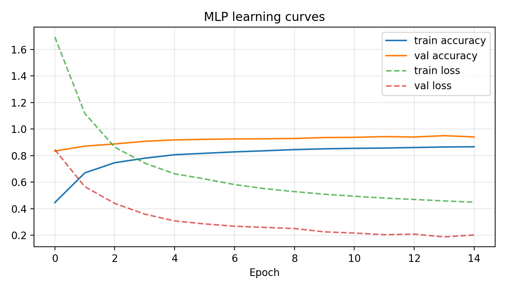
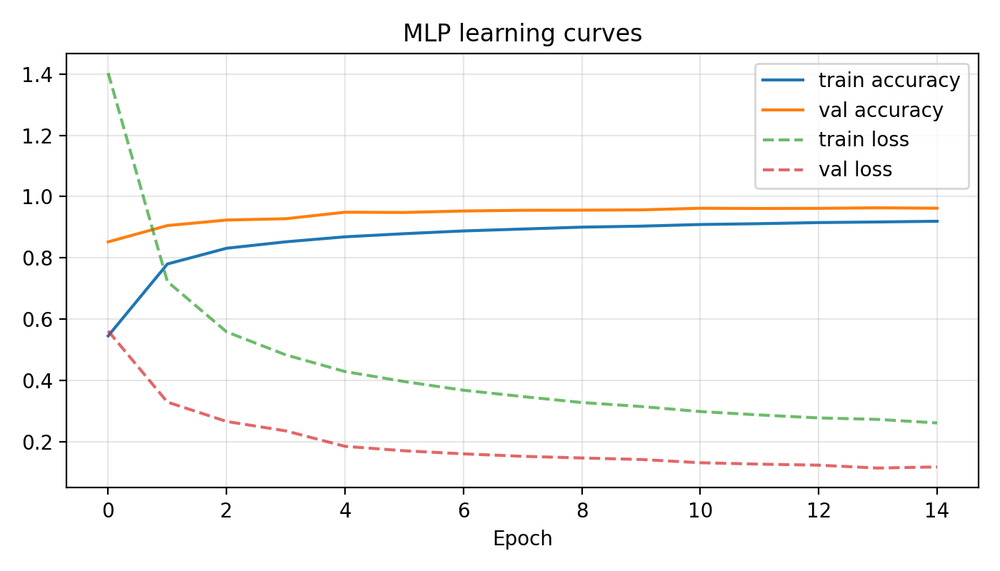
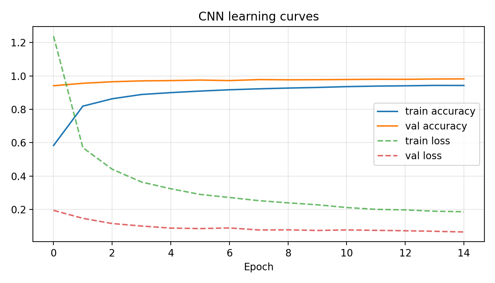
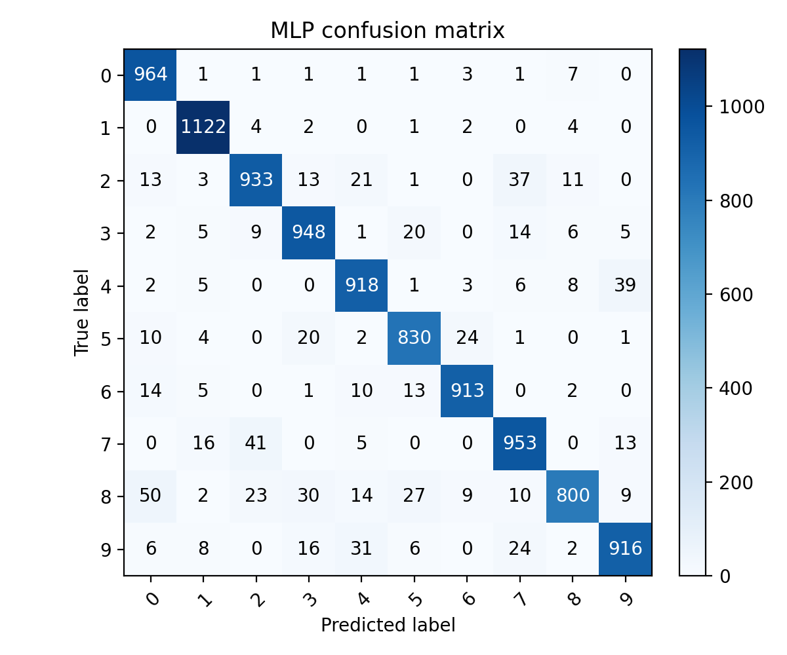
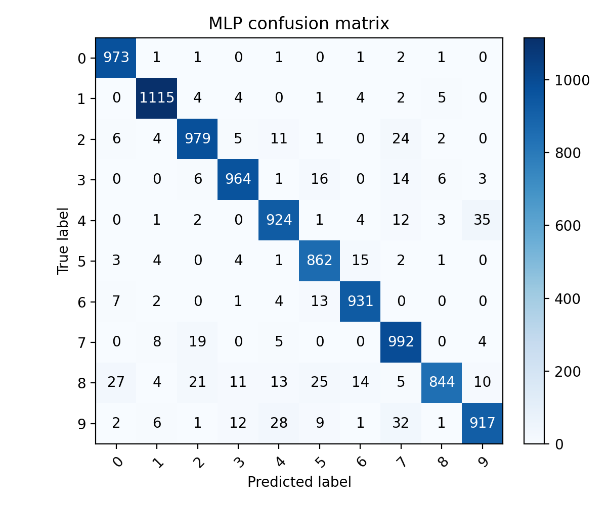

# MNIST Data Mining Showcase

Single-file, GPU-first MNIST classifier that compares shallow MLP, deeper MLP, and a small CNN. It is framed as a data mining mini-project with reproducible runs, clear metrics, and error analysis you can cite.

## Why this is data mining
- Supervised learning on a canonical, balanced dataset (28x28 grayscale digits).
- Feature learning progression: dense-only (handful of hidden layers) vs convolutional filters.
- Evaluation beyond accuracy: top-k accuracy, “Next-Best Option” (soft errors), confusion matrix, per-class stats.
- Reproducibility knobs (seed, batch size, validation split) and transparent device usage (GPU preferred).

## Quickstart
```bash
python -m venv .venv && source .venv/bin/activate
pip install tensorflow[and-cuda] scikit-learn matplotlib
python mnist_portfolio.py --demo --model mlp-deep --device auto
```
`--demo` runs 1 epoch on a reduced split for a fast sanity check.

One-command full GPU experiment (all presets, strong augmentation, logged artifacts):
```bash
./run_full_gpu.sh
```

## Typical runs
- Full MLP (deep) on GPU:  
  `mnist_portfolio.py --model mlp-deep --device gpu --require-gpu --save-report results/report.txt --save-metrics results/metrics.json --save-model results/models`
- CNN baseline (higher accuracy, more compute):  
  `mnist_portfolio.py --model cnn --device gpu --require-gpu`
- Comparative run (all presets, sequential):  
  `mnist_portfolio.py --model all --device auto --save-report results/compare.txt --save-metrics results/compare.json`
- With light augmentation + plots + CSV learning curves:  
  `mnist_portfolio.py --model cnn --augmentation light --save-plots results/plots --save-history-csv results/histories`
- CPU fallback: add `--device cpu` (omit `--require-gpu`).

Key flags:
- `--model` accepts a single preset, a comma list, or `all`.
- `--epochs`, `--batch-size`, `--validation-split` for training control.
- `--train-limit` / `--test-limit` for small experiments.
- `--save-report`, `--save-metrics`, `--save-model` to export artifacts.
- `--augmentation` set to `light` or `strong` for on-the-fly jitter (training only).
- `--save-history-csv` dumps per-epoch accuracy/loss for logging tools.
- `--save-plots` writes learning-curve + confusion-matrix PNGs (directory or filename prefix).

## GPU results (RTX 3090, full MNIST)
Baseline (no augmentation, earlier RTX 3090 sweep):
| Model        | Params   | Test acc | Next-Best Option | Top-2 | Top-3 | Notes |
|--------------|----------|----------|------------------|-------|-------|-------|
| MLP shallow  | 0.10M    | 0.9744   | 72.66%           | 0.9930| 0.9976| Fastest; good soft errors. |
| MLP deep     | 0.24M    | 0.9804   | 66.84%           | 0.9935| 0.9984| Higher accuracy; slightly lower soft-error rate. |
| CNN          | 0.42M    | 0.9918   | 86.59%           | 0.9989| 0.9998| Best overall; learns spatial features. |

Artifacts: `results/compare.txt`, `results/compare.json`, SavedModels in `results/models/*`.

Latest “strong augmentation” experiment (Dec 1, 2025; 15 epochs, batch 512, seed 42, strong aug):
| Model        | Test acc | Next-Best Option | Top-2 | Top-3 | Notes |
|--------------|----------|------------------|-------|-------|-------|
| MLP shallow  | 0.9297   | 71.83%           | 0.9802| 0.9919| Strong aug; more robust but lower raw acc. |
| MLP deep     | 0.9501   | 74.15%           | 0.9871| 0.9960| Better accuracy/soft errors balance. |
| CNN          | 0.9801   | 79.90%           | 0.9960| 0.9985| Best overall under augmentation. |

Artifacts (logged under timestamped folder): `results/exp_20251201T104924Z/compare.txt`, `compare.json`, SavedModels, plots, histories, and logs.

## Outputs and how to read them
- Accuracy and loss (test set): primary classification metric.
- Top-k accuracy: ranking-style metric; how often the correct class is in the top k probabilities.
- Next-Best Option: % of misclassified samples where the model’s 2nd choice is correct (evidence the learned manifold is close).
- Confusion matrix and per-class stats: which digits drive errors (e.g., 4 vs 9, 5 vs 8).
- Learning-curve CSV/plots: track convergence speed; compare augmentation vs. no augmentation runs.

## Visual gallery (GPU, strong augmentation, Dec 1, 2025)
Generated by `./run_full_gpu.sh` (15 epochs, batch 512, seed 42, strong aug). All assets live under `results/exp_20251201T104924Z`.

Learning curves  
- MLP shallow:   
- MLP deep:   
- CNN: 

Confusion matrices  
- MLP shallow:   
- MLP deep:   
- CNN: 

CSV learning curves for logging/EDA: `results/exp_20251201T104924Z/histories/*.csv`. Full log + environment snapshot: `results/exp_20251201T104924Z/logs/train.log` and `logs/env.json`.

## Suggested write-up structure (for a report)
1) Problem & data: MNIST as supervised digit classification; balanced classes; simple preprocessing (normalize + channel add).
2) Methods: shallow MLP (fewer parameters), deep MLP (more capacity), CNN (spatial filters). Device strategy (GPU-first) and seed for reproducibility.
3) Evaluation: accuracy + top-k + Next-Best Option + confusion matrix. Note training time differences and parameter counts.
4) Error analysis: highlight confusable pairs, whether 2nd-best probabilities are high, and implications for data quality/augmentation.
5) Recommendations: data augmentation (shifts/rotations), modest regularization, or larger CNN for better accuracy; consider latency/compute trade-offs.

## Real-world angles and trade-offs
- Capacity vs. speed: shallow MLP trains fastest; CNN is slower but typically most accurate.
- Robustness: CNN handles spatial variance better; MLPs are more sensitive to digit placement.
- Deployment: MLPs are lighter for edge devices; CNN better when accuracy is paramount.
- Data quality: High Next-Best Option suggests ambiguous handwriting—flag for labeling review or augmentation.

## Reproducibility notes
- Uses a global seed (`--seed`, default 42) for NumPy and TensorFlow.
- GPU selection is explicit; `--require-gpu` fails fast if no GPU is visible.
- Metrics and reports are exportable for audit trails (`results/*.json`, `results/*.txt`).
- `./run_full_gpu.sh` wraps a deterministic, timestamped experiment (sets seed + TF deterministic flags, snapshots `nvidia-smi`, environment, logs console output, and writes all artifacts under `results/exp_<timestamp>`).

## Directory layout
- `mnist_portfolio.py` — main entrypoint.
- `run_full_gpu.sh` — one-shot full GPU experiment with logging + artifacts.
- `archive_assignment/` — original assignment artifacts (kept for reference).

## Next steps (optional polish)
- Add small EDA block: class counts and pixel histograms to complement the model analysis.
- Provide lightweight TFLite export for edge deployment benchmarking.
- Add automated unit tests around metric calculations (top-k, Next-Best Option).

## Visual/easy-to-talk points
- Accuracy ladder: CNN > deep MLP > shallow MLP; CNN jumps ~1.7% absolute over shallow MLP with modest parameter increase.
- Soft-error view: CNN has the highest Next-Best Option rate (86.6%), showing confident second guesses when wrong.
- Deployment trade-offs: shallow MLP is the lightest for edge; CNN for best accuracy; deep MLP is a middle ground.
